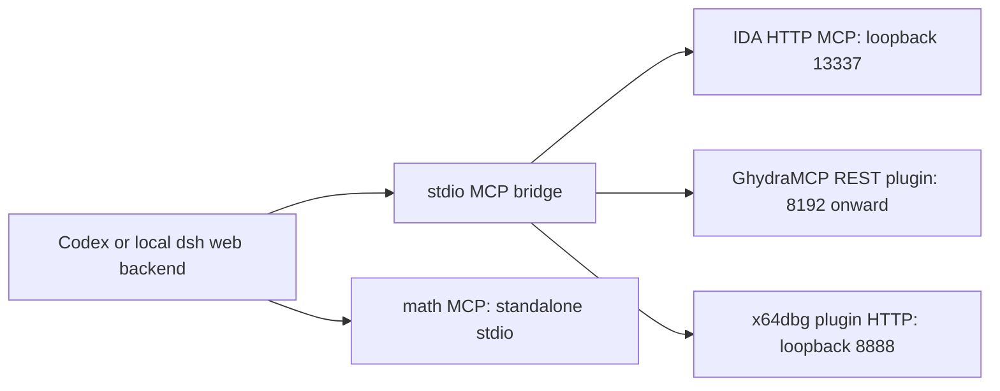

# Windows MCP clients and analysis backends

Use this guide when connecting Codex or a Windows-hosted `dsh web` to existing
IDA, Ghidra, x64dbg, or math tools. Agent clients own their configuration;
the routing core remains client-neutral. Tool paths come from local discovery.

For this repository's Codex client, keep the four local MCP entries in
`.codex/config.toml`; do not enable them globally. For dsh web, keep the MCP
entries in `.dsh/agent-presets/reverse-skill/agent.cordis.yml` and register that
preset root in the Web profile. Sessions explicitly select **Reverse Skill**;
DSH does not select it automatically from the workspace path. See the
[dsh adapter](dsh-web.md) for the different scope and shared preset lifetime.

## Choose the execution surface

MCP and idalib serve different purposes. MCP gives an agent named tools,
schemas, and a reusable client connection. idalib is IDA's headless analysis
API. An IDA MCP server can itself use idalib, so both can be used together.

| Need | Preferred surface | Evidence required |
|---|---|---|
| Repeated agent queries, cross-references, comments, shared GUI context | MCP | Client initialization, tool discovery, successful backend call |
| Large exports or a precise batch of IDAPython operations | Direct idalib/IDAPython | Script exit status, database identity, output hashes |
| Interactive debugger state | x64dbg MCP with its debugger plugin | Backend status and target identity; execution authorization remains separate |
| PCAP analysis or capture | TShark/dumpcap; Wireshark for visual inspection | Capture scope, command output, packet/stream references |
| Windows process, file, or handle observations | Existing Sysinternals CLI tools | Actual command result; do not invent a Sysinternals MCP wrapper |

MCP does not improve the decompiler by itself. Direct idalib remains a valid
fallback, but a direct library result is not evidence that MCP is connected.
Do not let independent clients mutate the same IDA database or debugger target
concurrently. Check the current program/session before each analysis phase.

## Separate bridge and backend

Each client starts its own stdio bridge. These bridges can reach the same local
analysis backend. GhydraMCP and x64dbg expose backend HTTP APIs; an HTTP listener
is not automatically a Streamable HTTP MCP endpoint.

| Backend | Agent-controlled startup | What a client config alone starts |
|---|---|---|
| IDA headless | Start the installed `ida_pro_mcp.idalib_server`, then open a database via the advertised session API | The Python stdio proxy only |
| IDA GUI | Open IDA and start its installed MCP plugin | The proxy only; plugin initialization may only register a hotkey |
| GhydraMCP | Open an enabled CodeBrowser tool and a project/program, then verify instance discovery | The Python bridge and its local discovery loop |
| x64dbg | Launch the debugger with the installed matching `.dp64`/`.dp32` plugin; an empty debugger is sufficient for a health check | The Python bridge only |
| math | No separate GUI/backend | The complete MCP server |

The agent should perform startup and verification when authorized, rather than
ask the user to copy tutorial commands. GUI applications or licenses that
actually require a human decision are reported with their precise blocker.

For the currently supported IDA headless and x64dbg entrypoints, use
[`start-local-backend.ps1`](../../skills/scripts/mcp/start-local-backend.ps1).
It accepts resolved executable paths, probes the real API, reuses a healthy
backend, records a newly started PID, and starts without a target. It never
kills an existing process or adds a login task. An occupied but unresponsive
port is a reason to inspect the existing backend, not replace it blindly.

For an existing authorized Ghidra project, use
[`start-ghidra-project.ps1`](../../skills/scripts/mcp/start-ghidra-project.ps1)
with its `.gpr` path and optional project-internal program path. Import a new
file into its own case project first. The helper checks project identity,
loopback binding, and program name; the selected port is an expected instance,
not a command to reconfigure the plugin. It preserves other running projects.
The permanent MCP configuration should use the stdio bridge wrapper, not a
fixture-specific launcher that opens the same sample on every client startup.

## Agent setup and verification order

1. Read the user's installed bridge and backend configuration; resolve Python,
   Node, tool executable, plugin, and client profile paths.
2. Verify the actual MCP package API. Preserve an installed compatible version;
   do not assume `idb_open` and `idalib_open` are interchangeable.
3. Prepare the client-specific configuration. Back up the destination and merge
   only the selected server entries; preserve credentials, providers, models,
   other servers, and instruction files.
4. Start/reuse the local backend. Confirm the listening address and the real
   application response, not just an open TCP port.
5. Initialize the stdio bridge, enumerate tools, and perform a bounded operation:
   IDA session/functions; Ghidra instances/functions; x64dbg empty-session
   status; math `add(19,23) = 42`.
6. Verify through the actual client runtime. Codex app-server inventory and a
   DSH Cordis MCP-client harness can run without a model request. Then confirm
   that the deployed configuration loaded in the intended client/profile.
7. Record installed, configured, initialized, backend-connected, and
   tool-call-verified separately. Save the test fixture identity and results.

## Version-specific findings

The local GhydraMCP v2.2.0 bridge reads `GHIDRA_HYDRA_HOST` and starts discovery
at 8192; it does **not** parse a positional `http://127.0.0.1:13337` argument.
Remove that argument. Its quick range covers ten ports, while its broader
discovery supports more instances. Select the discovered instance explicitly.
The older LaurieWired integration mentioned elsewhere in the bootstrap
manifest uses a different API/port convention; it is not this Hydra bridge.

This GhydraMCP release binds its HTTP server with `InetSocketAddress(port)`,
which was observed as wildcard `::` on Windows. The bridge's host environment
does not restrict that listener. The optional, version-specific
[loopback patch](patches/ghydra-v2.2.0-rc2-loopback.patch) changes the HTTP bind
and temporary port probe to `127.0.0.1`. Build against the exact installed
release, retain the original JAR and its hash, and verify the listening address
after startup. This is a local build variant, not an upstream release or a
firewall change. Source: [official v2.2.0-rc.2 plugin](https://github.com/starsong-consulting/GhydraMCP/blob/v2.2.0-rc.2/src/main/java/eu/starsong/ghidra/GhydraMCPPlugin.java).

The distributed patch uses zero context to omit upstream whitespace-only lines.
Against the exact source release, validate with `git apply --check --unidiff-zero`
before applying it with `git apply --unidiff-zero` and the patch file path.

Use [`ghydra-stdio.py`](../../skills/scripts/mcp/ghydra-stdio.py) with
`--bridge <installed-bridge.py>` when this release prints diagnostics to stdout.
It redirects only that module's `print` calls to stderr, leaving MCP frames on
stdout. It also removes the tested bridge's obsolete duplicate `analysis_run`
definition: the retained tool accepts `background` and `port` and calls
`/analysis/run`, matching the plugin endpoint. Unknown duplicate signatures or
endpoints stop startup for inspection instead of silently choosing a tool.
It starts the bridge only and does not select or execute a sample.

The supplied x64dbg bridge imports `mcp.server.fastmcp.FastMCP`. An unpinned
`uv --with mcp` resolved to an incompatible 2.x environment during testing.
Use a dedicated environment with the tested `mcp==1.6.0` and
`requests==2.32.3`, and retain its complete dependency lock. A persistent
environment is preferable to embedding an evictable uv cache path in a client
config. `X64DBG_URL` must end in `/` because this bridge concatenates endpoint
names directly. Its `IsDebugging()` can hide connection failures as `false`;
verify the raw backend response as well.

Launch that x64dbg bridge through
[`x64dbg-stdio.py`](../../skills/scripts/mcp/x64dbg-stdio.py), passing
`--bridge <installed-x64dbg.py>`. The launcher adds the bridge's `serve` argument.
The launchers use the adjacent `bridge_compat.py` and `stdio_shutdown.py`; copy/update the whole
`skills/scripts/mcp/` directory when moving the setup to another machine.

With the tested MCP 1.6.0 / Pydantic 2.13.5 / pydantic-settings 2.15.0 combination,
the compatibility module rebuilds FastMCP settings before their first use,
resolving the `lifespan` forward reference. The x64dbg adapter uses an internal
parameter alias for `RegisterGet` and `RegisterSet`, retaining the public MCP
argument and HTTP key `register`. This removes the model-attribute collision
without changing callers. Adaptations happen in memory; installed bridge files
and dependencies are unchanged, and unrelated warnings remain visible.

Run `skills/scripts/test-mcp-bridge-compat.py` with the tested bridge Python.
It checks actual MCP stdio initialization, tool schemas and calls against inert
fixtures, including both `background` values and missing register arguments.
The math startup banner and SDK `ListToolsRequest` messages are ordinary stderr
logs and are not disabled by these adapters.

On Ctrl+C, the launchers let the asynchronous stack unwind, then translate only
`KeyboardInterrupt` into exit status 130 without a traceback. Other exceptions
remain visible. For the tested MCP 1.6.0 SDK, the process-local shutdown adapter
also closes the server's incoming message sender when its transport receive
loop ends; otherwise EOF can leave the server waiting for a stream that would
only close during later context cleanup. This version-gated adaptation is
idempotent when a legacy outer launcher wraps an inner launcher.

`test-mcp-shutdown.py` uses isolated child processes to verify SIGINT, EOF, and
real errors across the direct and legacy launcher combinations. It raises the
signal only inside the test child; it does not send Ctrl+C to a live Host or
debugger. Updating these scripts takes effect on the next bridge launch and
does not require another change to an already-correct command/args setting.

The math server accepts JavaScript `number` values. For exact 64-bit addresses,
use Python integer arithmetic or a verified address-conversion tool rather than
assume arithmetic above `2^53 - 1` is exact.

## Client adapters and sources

- [Codex configuration](codex.md)
- [Local Windows dsh web configuration](dsh-web.md)
- [IDA backend details](../../skills/ida-reverse/LOCAL-SETUP.md)
- [Official Codex MCP documentation](https://developers.openai.com/codex/mcp)
- [IDA MCP source](https://github.com/mrexodia/ida-pro-mcp)
- [GhydraMCP source](https://github.com/starsong-consulting/GhydraMCP)
- [DSH MCP client source](https://github.com/deepseek-ai/deepseek-harness/tree/master/packages/mcp/mcp-client)

Local readiness reports and machine-specific configurations belong in ignored
`work/` artifacts. Portable documentation must not embed a user's credentials
or silently activate a different client's configuration.
